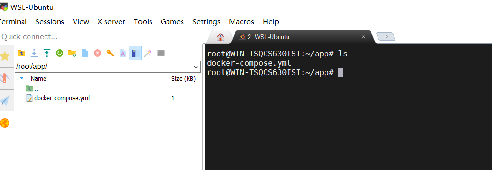
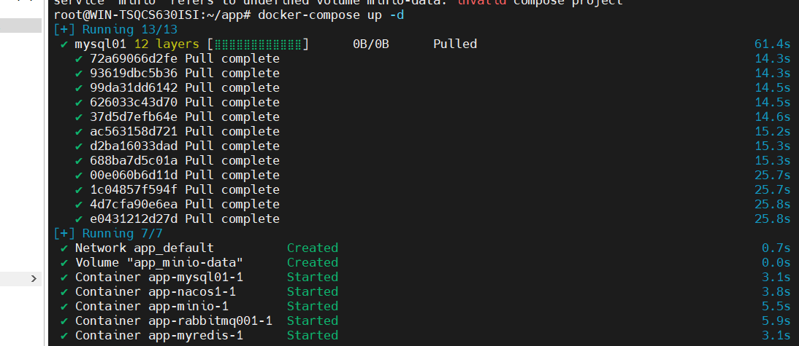
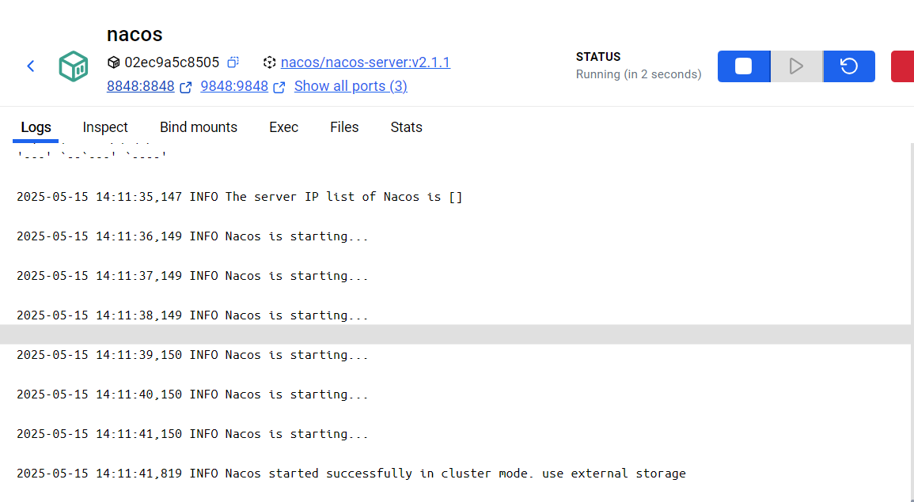

# 一键部署中间件

第一步：将本目录里面的docker-compose.yml存入虚拟机中，like this：



第二步：运行指令

```
docker-compose up -d
```



第三步：进入 rabbitmq 容器并执行相关操作

```
docker exec -it 容器名 /bin/bash 
rabbitmq-plugins enable rabbitmq_management 
cd /etc/rabbitmq/conf.d/ 
echo management_agent.disable_metrics_collector = false > management_agent.disable_metrics_collector.conf 
exit
```

第四步：重新启动nacos的服务
```
Nacos最初启动的时候，mysql还没有载入sql文件。需要我们重新启动一次
```

注意：

rabbitmq默认的用户名和密码都是guest

nacos默认的用户名和密码都是nacos

minio用户名是root，密码是123456789

redis没有设置密码

mysql的root的密码是123456

如果各位想改的话，可以在docker-compose.yml上面进行相应的修改

docker exec -it 47f9e9fdbe03 /bin/bash 
