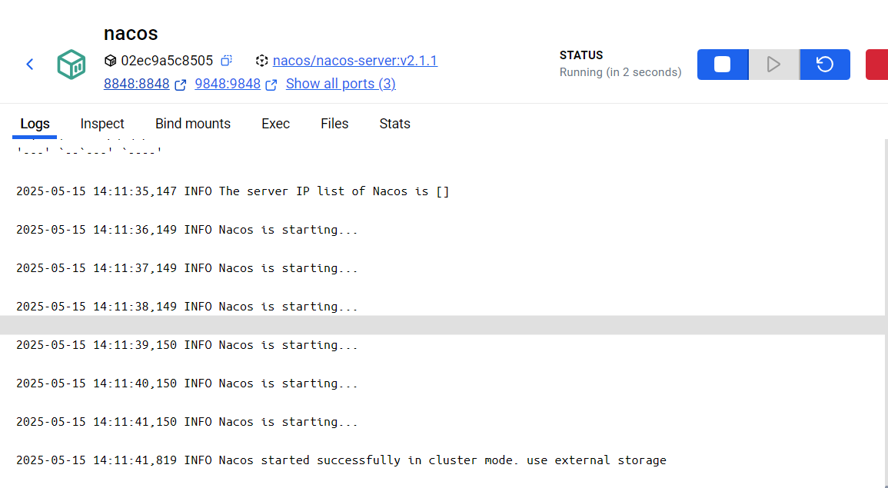

# 一键部署中间件

第一步：将本目录里面的docker-compose.yml存入虚拟机中，like this：


第二步：运行指令

```
docker-compose up -d
```


(已切换其他镜像，启动后自动开启管理面板)
~~第三步：进入 rabbitmq 容器并执行相关操作~~

```
docker exec -it 容器名 /bin/bash 
rabbitmq-plugins enable rabbitmq_management 
cd /etc/rabbitmq/conf.d/ 
echo management_agent.disable_metrics_collector = false > management_agent.disable_metrics_collector.conf 
exit
```

第四步：重新启动nacos的服务
```
Nacos最初启动的时候，mysql还没有载入sql文件。需要我们单独启动一次

docker-compose restart nacos
```

注意：

1. rabbitmq默认的用户名和密码都是guest

2. nacos默认的用户名和密码都是nacos

3. mysql的root的密码是123456

4. 如果各位想改的话，可以在docker-compose.yml上面进行相应的修改
