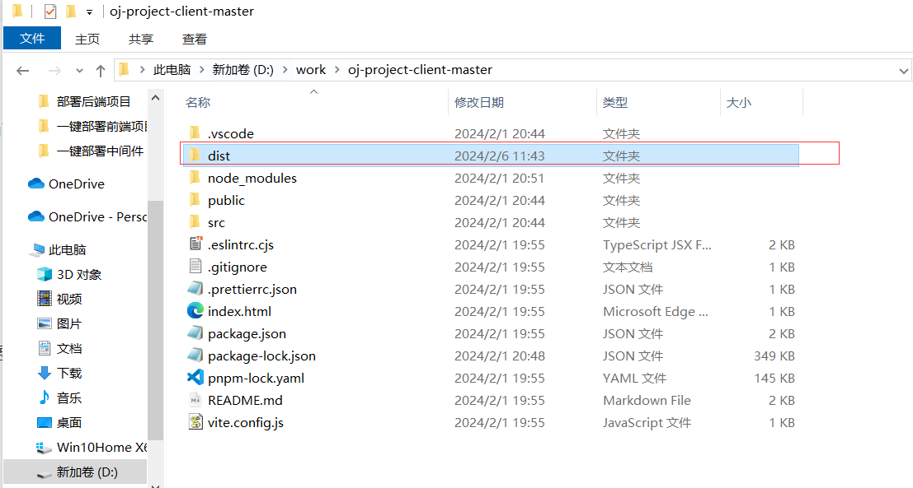
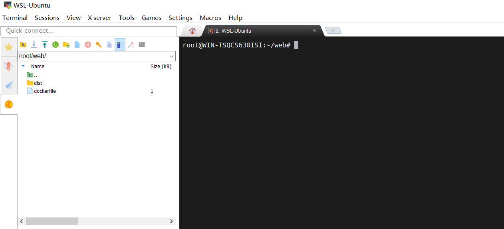
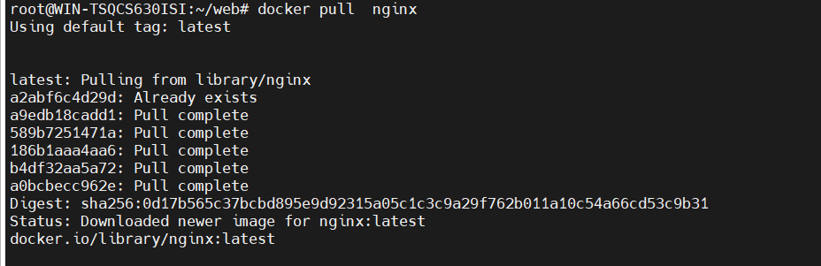
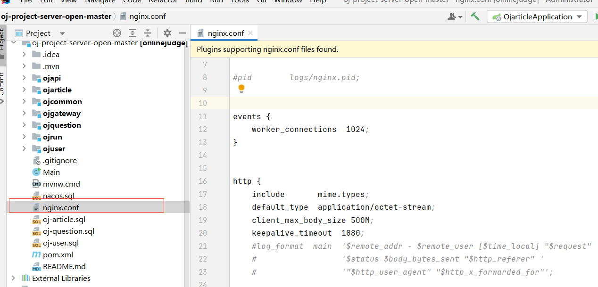
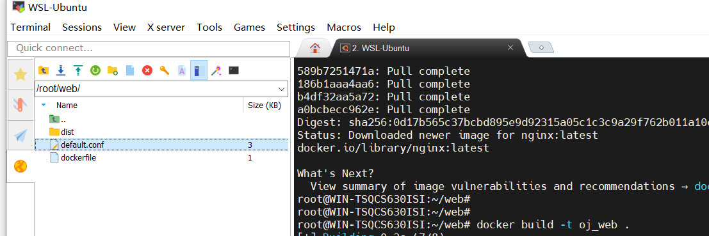
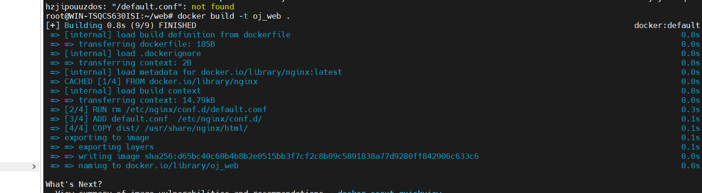
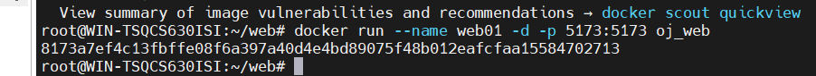
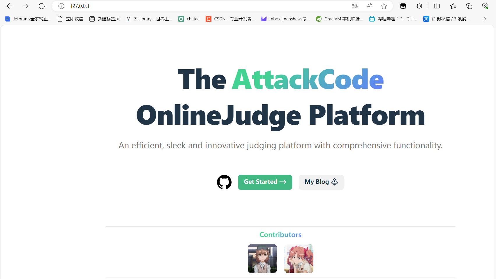

# 部署前端项目

## 第一步：运行以下指令

```
npm run build
```

生成dist文件夹



## 第二步：将dist文件夹整个复制到虚拟机的某个目录中




## 第三步：执行命令，记住把your_image_name换成自己想要换的名字

```
docker build -t your_image_name .
```

当然，如果各位没有nginx镜像的话，可能会出错。所以先把nginx下载过来

```
docker pull  nginx
```



因为没有default.conf文件，我们打开项目，将nginx.conf改成default.conf保存到当前目录即可






镜像的维护者信息为 那个cyl也要进行修改

然后再执行下面命令：

```
docker build -t oj_web .
```



## 第四步：利用生成好的镜像创建容器

```
 docker run --name web01 -d -p 80:80 oj_web
```



访问浏览器即可。


