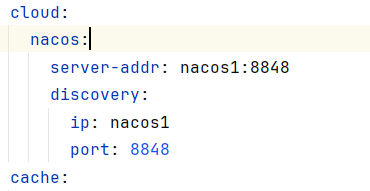
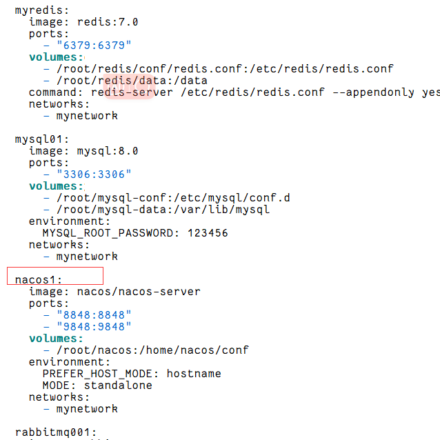
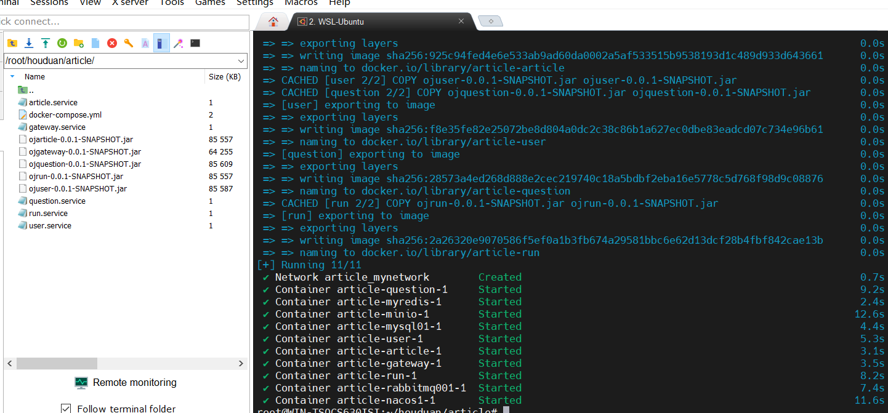
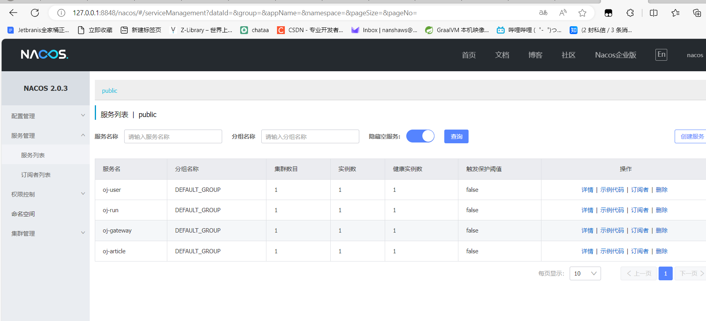

# 后端部署的详细过程

打包成jar包之前，要根据docker-compose.yml文件里面的名称进行修改，如下图所示，这些都需要修改





需要把每个项目打包成一个一个jar包，然后和dockerfile文件放在一个目录下面。like this



然后执行命令即可

```
docker compose up -d
```


注意：dockerfile上面的东西需要修改的修改,比如说jar包的名字之类的。


然后在去nacos上面看看


